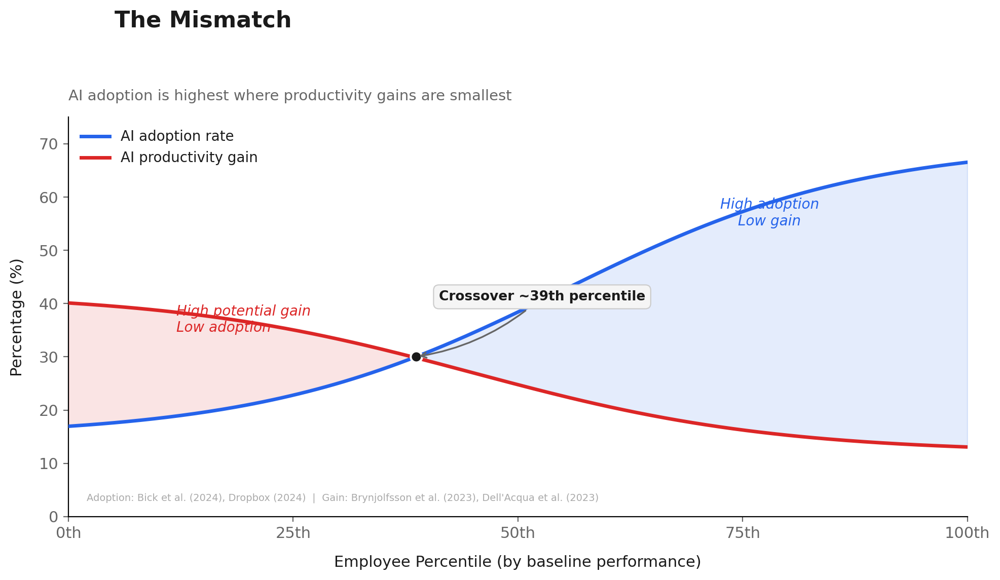
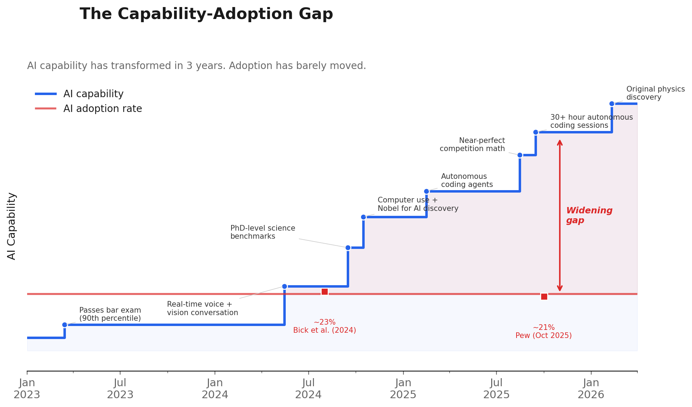

# The Integral Problem: Why AI Isn't Moving the Productivity Needle

## TL;DR

- **The problem**: Lab studies show 14-40% individual productivity gains from AI. Aggregate economic impact: 0.01 percentage points. A gap of roughly 1,000x.
- **The hypothesis**: AI adoption and potential gain are inversely correlated. The people who would benefit most aren't using the tools; the people using them most need them least.
- **What to do**: Mandate the AI path with patience, replace demos with team-specific training, invest in agentic interfaces, and build guardrails instead of gates.

---

"AI is everywhere except in the incoming macroeconomic data," Apollo's chief economist Torsten Slok wrote last month, invoking a 40-year-old observation. In 1987, Nobel laureate Robert Solow looked at a decade of IT investment and wrote: "You can see the computer age everywhere but in the productivity statistics." The San Francisco Fed recently concluded that Solow's paradox remains relevant today.

Last week, GPT-5.2 derived an original result in theoretical physics -- a formula that physicists had assumed was zero for decades, produced through a 12-hour scaffolded reasoning session with researchers from the Institute for Advanced Study, Cambridge, and Harvard. Penn Wharton measured AI's actual impact on aggregate total factor productivity and found 0.01 percentage points.

One curve is practically vertical. The other is flat.

I've spent the last two and a half years working across engineering and product teams at a large tech company, evaluating every major AI model release -- not through chat and demos but by integrating each one into my actual work. Customer communications, data analysis, code generation, product planning. I subscribe to every frontier AI service and test them end-to-end on real tasks.

And in every team I worked with, at most 1 in 20 engineers had truly adopted AI into their daily workflow. Not 1 in 20 across the company. One in twenty among core engineering and product teams -- young, tech-savvy people who build software for a living. The people who should have been first.

That ratio is not an anecdote. Once I started looking at the research, I found it everywhere.

## The mismatch

Here's what makes this story more painful than a simple "people aren't adopting new technology" narrative.

*Sources: Brynjolfsson, Li & Raymond (2023); Bick, Blandin & Deming (2024)*

The people who would gain the most from AI are the least likely to use the tools.

Brynjolfsson, Li, and Raymond studied 5,179 customer support agents at a Fortune 500 company and found that AI increased overall productivity by 14%. But the gains were wildly uneven. The bottom quintile improved by 35%. The top quintile improved by roughly zero. The AI had essentially encoded the knowledge of top performers and redistributed it downward.

Now look at who actually uses it. Bick, Blandin, and Deming ran the first nationally representative U.S. survey on generative AI use and found a stark 2:1 education gradient -- about 40% of college-educated workers use AI at work, compared to about 20% without a degree.

I saw this play out in my own teams. The engineers who were already the most productive -- the ones writing the cleanest code, the ones with strong mental models of the codebase -- were the ones experimenting with AI. The junior engineers, the ones ramping up on new systems, the ones who would have benefited most from an AI that could explain unfamiliar code or suggest patterns they hadn't learned yet? They barely touched the tools.

The mismatch is almost perfectly inverted. The workers who gain 35% from AI adopt at half the rate of workers who gain close to zero.

> *The people standing to gain the most from these tools are the ones who aren't using them, and the people using them the most are the ones who need them least.*

This is the thesis that makes everything else in this post click. It's not just that adoption is low. It's that adoption and potential gain are inversely correlated.

## The integral problem

If I visualize organizational productivity, the y-axis is the output of each employee and the x-axis is the employee percentile. The total productivity of the organization is the area under that curve -- the integral.

A note on scope: I'm talking about productivity here, not revenue. AI today is overwhelmingly focused on making people better at what they already do -- speeding up existing tasks, not identifying new work or new markets. That transformation is coming, but it's not here yet.

*Sources: Brynjolfsson et al. (2023); BCG-Harvard (2023); Bick et al. (2024)*

The realized gain at any point on the distribution equals the individual gain multiplied by the adoption rate:

*Realized Gain(x) = Individual Gain(x) x Adoption Rate(x)*

Both factors work against us. At the bottom, where individual gains are highest (35% per Brynjolfsson), adoption is lowest (around 20% per Bick). At the top, where adoption is highest, individual gains are smallest. You're multiplying big numbers by small numbers everywhere.

The result shows up in the macro data. Lab studies consistently find 14-40% productivity gains for specific tasks. Penn Wharton measured 0.01 percentage points of actual aggregate impact. That's a gap of roughly 1,000x.

> *"It's not electricity, it's not refrigeration -- it's not that transformative." -- Kent Smetters, Penn Wharton Budget Model*

The Anthropic Economic Index measured AI usage patterns across enterprise deployments and found a Gini coefficient of 0.84 to 0.86 -- more concentrated than income inequality in the most unequal country on Earth. A tiny cluster of power users accounts for almost all usage. Frontier workers in their dataset sent 6x more messages than the median enterprise user.

### Amdahl's Law

The mismatch explains part of the gap. But even among the people who do use AI, the gains don't translate as expected.

Amdahl's Law, formulated in 1967, states that the overall speedup of a system is limited by the fraction of the task that cannot be improved:

*Speedup = 1 / ((1 - p) + p/s)*

Where *p* is the fraction of work that AI accelerates and *s* is the speedup factor.

A Microsoft study of 484 developers found they spend only about 11% of their time actually writing code. The rest goes to meetings, debugging, architecture, code review, and everything else. Run the math. If coding is 20% of a developer's time and AI makes it 3x faster, the theoretical maximum improvement is 15%. Even if AI made coding infinitely fast -- instant, zero time -- the maximum improvement is 25%, because the other 75-80% of the work isn't coding.

The most striking confirmation comes from METR's randomized controlled trial. Sixteen experienced open-source developers, averaging 5 years of experience on their specific repositories, were randomized to use or not use AI tools on 246 tasks. The result: developers using AI were 19% *slower*. But they believed AI had sped them up by 20%. A perception gap of nearly 40 percentage points.

### The organizational multiplier

Michael Kremer's O-Ring theory -- named after the Challenger disaster, where a single faulty component destroyed the entire shuttle -- models production as a multiplicative function. If any one person in the chain fails, they destroy a disproportionate fraction of the product's value. Applied to AI: when only 1 in 20 team members uses AI effectively, the other 19 still set the pace. It doesn't matter that your best engineer writes code twice as fast if the bottleneck is the design review, the QA process, or the deployment pipeline.

Google's Project Aristotle studied 180 internal teams and found that "who is on a team matters less than how the team members interact." Psychological safety -- not individual brilliance -- was the single strongest predictor of team performance. Having one AI power user on a team of twenty is like having one superstar on a team that can't communicate. The individual's output is constrained by the system around them.

Most organizational work is not a breakthrough discovery or a transformative deal. It's execution. Delivery. Operations. The kind of work where the aggregate matters, where the integral under the full curve determines what ships. And right now, the mismatch and Amdahl's Law are working in concert to ensure that integral barely moves.

## The capability-adoption gap

The timeline makes the absurdity visible.

*Source: Compiled from public announcements and benchmark data*

In March 2023, GPT-4 passed the bar exam at the 90th percentile. By late 2024, reasoning models performed at PhD levels on physics and chemistry. By early 2025, autonomous coding agents shipped. By February 2026, GPT-5.2 contributed original theoretical physics. The capability curve is practically vertical.

The adoption curve stays flat. According to Lucidworks, 42% of companies abandoned most of their AI initiatives in 2025, up from 17% in 2024. Companies aren't ramping up. They're giving up.

Meanwhile, a handful of companies are seeing massive returns. Shopify mandated AI as a baseline expectation and saw non-engineering teams become their fastest-growing AI users. JPMorgan went from banning ChatGPT in February 2023 to deploying LLM Suite to 200,000 employees within eight months.

The gap isn't between companies that have AI and companies that don't. It's between companies that enabled it broadly and companies that are still running pilots.

## Why the gap exists

I've watched this play out up close for over two years. Five problems keep surfacing.

### The learning curve is real

I consider myself AI-fluent. I've been building with these tools since GPT-3. And even for me, getting truly productive with AI required significant effort.

I got lucky. During paternity leave, I had unstructured time to experiment. I'd hold my son in one arm and voice-transcribe prompts with the other. That sounds absurd, but it gave me something almost no working professional gets: hours of low-stakes experimentation. Trying things, failing, adjusting, building intuition. That's what it actually takes.

Most employees don't have that. They have meetings, deadlines, and sprint commitments. They get maybe 30 minutes to try a new tool before the next Slack message pulls them away. That's not enough to build fluency.

Humlum and Vestergaard found something that should alarm every manager trying to drive adoption. In their study of 18,000 Danish workers, even when researchers randomly informed workers that AI could halve their task time, it had no effect on usage. None. Information alone doesn't drive adoption. The frictions -- lack of time, lack of training, lack of integration into existing workflows -- are causal barriers, not just correlates.

This is not an awareness problem. It's a friction problem.

### The belief deficit

People's impression of AI is shaped by two forces, both misleading.

On one side: high-profile failures. Google's AI Overview told users to put glue on pizza and eat rocks. GPT-5.2 Pro spent 2 minutes and 45 seconds reasoning through the "car wash test" -- should I walk or drive to the car wash? -- explicitly noted in its chain of thought that "the wash requires the vehicle to be present," and then still concluded the user should walk.

On the other side: aspirational marketing divorced from reality. Companies spent roughly $8 million per 30-second spot during the 2026 Super Bowl, where 23% of all ads featured AI. Google ran a Gemini ad during the 2025 Super Bowl that hallucinated a false fact about Gouda cheese on national television. The overall reception of AI ads was "sharply negative," with Adweek writing that it "revealed AI's messaging crisis."

The result: only 32% of Americans express trust in AI. Can you blame someone for not wanting to stake their reputation on a tool they associate with eating rocks on one end and unfulfilled marketing promises on the other?

The irony is that the real AI innovation -- the tools that actually work -- is happening in places most people never see. Terminal-based coding agents, agentic workflows that chain together dozens of operations. These succeed precisely because they target constrained domains where outputs can be immediately verified. Does the code compile? Does the test pass? But they aren't flashy enough for a Super Bowl ad.

The belief deficit is fixable. BCG found that positive sentiment toward AI jumps from 15% to 55% when employees receive strong leadership support. That's a 40-percentage-point swing driven entirely by whether leadership signals that AI is a serious initiative rather than a fad.

### Corporate training has not evolved

Every AI training I attended was a marketing person who didn't understand the problems employees actually work on, demoing integrations nobody asked for -- or an executive showing off tools that employees aren't even allowed to use.

The audience nods politely. Then everyone goes back to their desks and nothing changes. Not because the demos were wrong, but because they were completely disconnected from the ways people actually work. Nobody walked away understanding how the tool would help them maintain the same quality and attention to detail as their existing workflow.

BCG's numbers tell the story: employees who received 5 or more hours of training became regular AI users at 79%, compared to 67% for those with less. Twelve percentage points of adoption driven by the difference between serious training and token training.

Real training looks like capstone projects, not lunch-and-learns. Each team builds a tool or workflow for their specific use case. A sales team builds automated prospect research. A support team builds a knowledge base query tool. An engineering team builds a code review assistant. The output is something they actually use the next week.

### Enterprise tools aren't ready

Companies love to shove their own half-baked AI wrappers down employees' throats. "Use our internal copilot. It's approved by security." The internal copilot is a thin wrapper around a rate-limited API with a clunky interface and a model that's two generations behind.

Meanwhile, the tools that actually work -- Claude Code, Cursor, GitHub Copilot -- are either blocked or in a gray area. So what happens? Shadow AI. Industry surveys consistently find that roughly 78% of AI users bring their own tools to work.

> *When you make it hard to use AI, people either don't use it or use it outside your visibility. Neither outcome is what you want.*

JPMorgan banned ChatGPT in February 2023 after engineers pasted proprietary code into it. They spent a year building LLM Suite, and now have 125,000+ daily active users. The pattern repeats: ban, realize banning doesn't work, build secure infrastructure, enable broadly.

### Productivity is deeply personal

Knowledge work is individual. The way I write code is different from how you write code. The way I draft documents, run analyses, manage projects -- all different. There is no single AI workflow that fits everyone.

Enterprise tools are designed as if one workflow works for all. It doesn't. A product manager needs AI for different things than a backend engineer, who needs it for different things than a data scientist.

The Anthropic Gini data (0.84-0.86) isn't just measuring adoption rate. It's measuring the deeply personal nature of productivity. The power users aren't power users because they got a better demo. They're power users because they invested the time to build workflows that fit their specific work.

BCG's data on the "silicon ceiling" drives this home. Frontline worker adoption stalled at 51% in 2023 and hasn't moved since. The ceiling isn't a capability ceiling. It's a personalization ceiling.

## The agentic interface

There's an analogy that keeps coming to mind. By the early 1990s, the internet's underlying capability was extraordinary -- email, file transfer, hyperlinked documents spanning the globe. But using it meant memorizing terminal commands, understanding protocols, configuring network settings manually. The capability existed, but it was locked behind an interface that excluded almost everyone.

Then the browser shipped. The technology didn't change. The interface did. And that interface change turned the internet from an academic tool into the defining infrastructure of modern life.

AI is in its pre-browser moment right now. The capability is remarkable and accelerating. But the dominant interfaces constrain what's possible.

The most powerful AI tooling lives in the terminal -- Claude Code, Codex CLI, Aider. That's not incidental; it's structural. CLI tools have full access to your machine. They can read files, write code, run tests, chain tools together, and enforce quality control through version control and automated testing. You can't do this from a chat window where your only option is copy and paste.

Here's a concrete example. Two years ago, I drove a customer communication program reaching out to hundreds of customers at a large tech company. It was slow, imprecise, and mostly ineffective -- generic messages and hoping they landed. Using agentic AI tools today, the same campaign can be surgical: pulling data from a CSV, looking up contacts through browser automation, drafting tailored emails based on usage patterns, sending through authenticated APIs. All from a single interface.

But it wasn't easy. It took trial and error -- not just prompt iteration but finding ways to string together tools at scale. The effort pays off, but you have to invest it. The enterprise chat wrappers that promise "AI in a box" can't deliver this level of integration.

The investment signal is unmistakable. Claude Code crossed $1 billion in annualized revenue faster than ChatGPT. Cursor hit $1 billion ARR. Developers aren't waiting for enterprise tooling to catch up. They're building their own agentic workflows now.

Invest in agentic interfaces, not just chat wrappers. The browser didn't just make the internet easier to use. It made entirely new categories of work possible.

## What to do Monday morning

I've laid out the problem. Here's what I'd actually do about it, starting this week.

### Mandate the AI path, with patience

For new projects, default to the AI-assisted approach. Don't make it optional. But hold quality to the same bar as before. The goal is not to ship faster. The goal is to ship the same quality, faster, once people are up to speed.

Here's the part most managers skip: you have to budget for a temporary productivity dip. You cannot mandate AI and then penalize people for being slower while they learn. That kills adoption dead. Humlum's research showed that even knowing about AI's benefits doesn't change behavior when friction is high. You have to actively reduce the friction, which means time and patience.

### Invest in applied training, not demos

Stop doing demo-driven AI training. Today. It's worse than useless because it creates the illusion that you've invested in adoption.

Real training means capstone projects, not slide decks:
- Each team builds a tool or workflow for their own use case
- Mentoring and coaching from AI-fluent colleagues throughout
- A supportive environment where AI is the default approach -- even when it's initially slower
- Follow-up sessions to share what worked and what didn't

I became fluent during paternity leave because I had unstructured time. You can't give everyone paternity leave, but you can create the expectation that if a problem can be solved manually or with AI, choose the AI route.

### Embrace agentic interfaces

The real productivity unlock is not the enterprise chat wrapper your company deployed last quarter. It's the agentic tools that integrate into real workflows -- tools that pull data from your systems, automate routine actions, chain together multi-step operations, and iterate on failures without you managing every step.

Give teams the budget and permission to explore agentic tools. Solve for security at the platform level so you can say "yes" to the tools that actually work.

### Accept that productivity is personal

Stop prescribing. There is no one-size-fits-all AI workflow. The Anthropic Gini coefficient of 0.84-0.86 is a measure of how personal AI productivity is. The power users found workflows that fit their specific work. You can't copy-paste that across a thousand people.

Give people time and explicit permission to find their own use cases. Let adoption be organic, messy, and personal. The goal is to move the whole distribution rightward, not to force everyone through the same door.

### Enable, don't gate

Stop battling shadow AI. You will lose.

If 78% of AI users are bringing their own tools to work, the problem is the approved tools. JPMorgan went from banning ChatGPT to deploying LLM Suite to 200,000 employees, solving for compliance at the infrastructure level. Shopify made AI usage a performance expectation and removed all token quotas. The pattern is consistent: solve for security at the platform level, then open the gates.

Trust your employees. Build guardrails, not gates.

## The bottom line

The gap between AI capability and AI impact is not a technology problem. It's an organizational one, compounded by a mathematical one.

The mismatch means the people who would benefit most aren't using the tools. Amdahl's Law means that even among those who do, speeding up one part of the workflow just moves the bottleneck. The integral barely moves because both forces work in concert.

Nearly 90% of the 6,000 executives surveyed in the NBER study said AI has had no impact on employment or productivity over the last three years. And yet those same executives forecast 1.4% productivity growth from AI over the next three. The belief is there. The results aren't. That's the Solow paradox, playing out again in real time.

The research consistently shows 14-40% productivity gains in controlled settings. The economy shows 0.01 percentage points. That 1,000x gap isn't going to close with better models. It's going to close when organizations stop treating AI as a tool for their most advanced employees and start treating it as infrastructure for everyone.

The integral only changes when the whole curve moves. Not just the tail.
