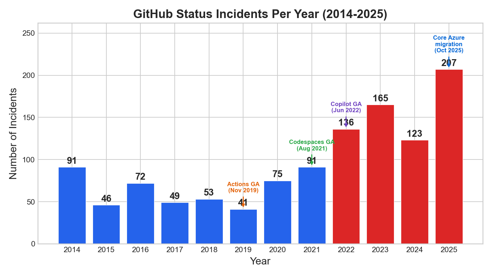
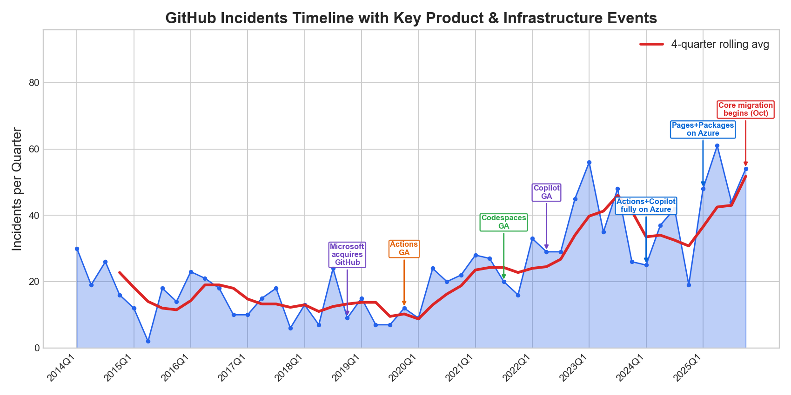
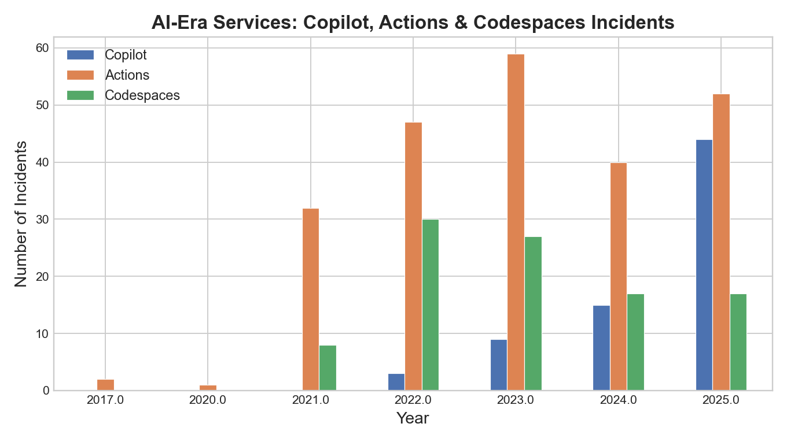
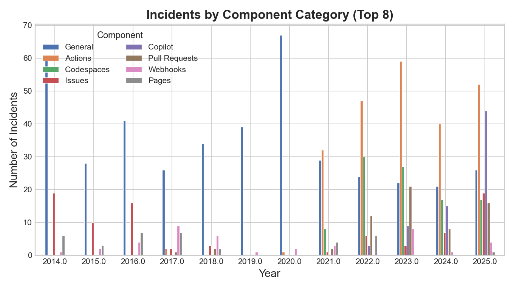
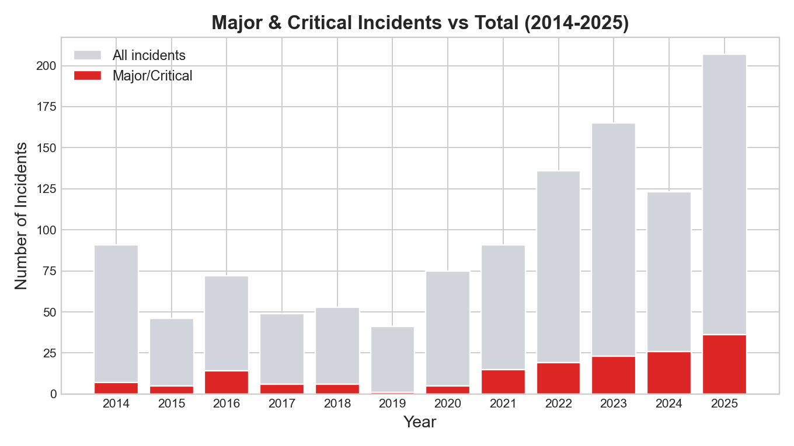
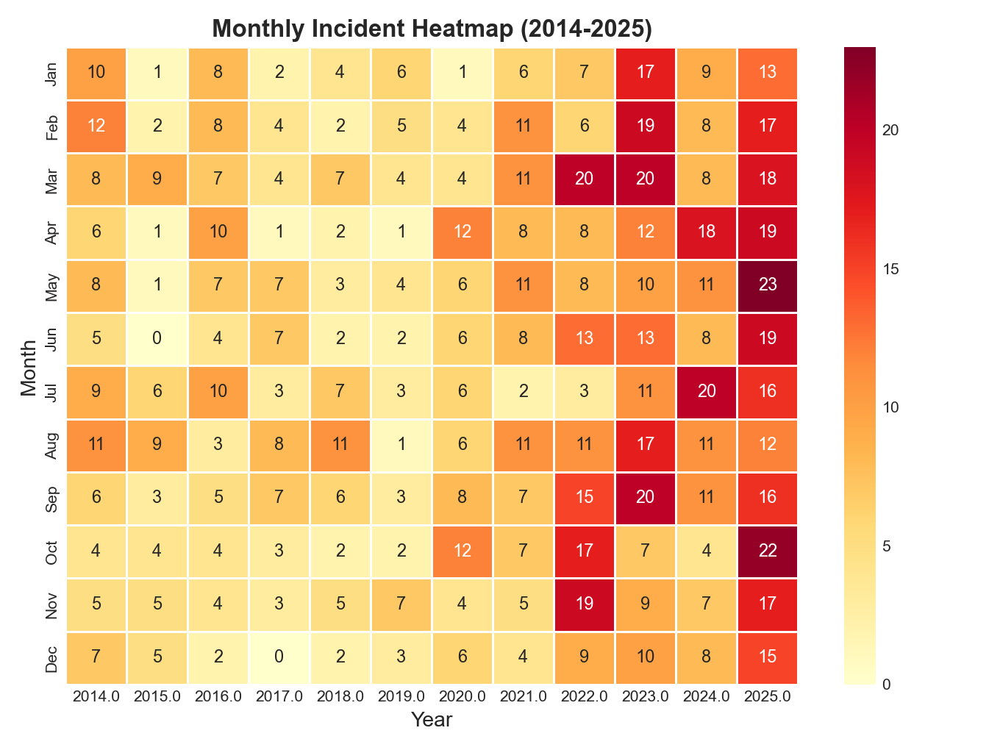

# GitHub's Outage Problem Isn't About Azure

After yesterday's GitHub outage, the usual suspects appeared on Hacker News and Twitter: "This is what happens when you migrate to Azure." But is that actually true? I decided to look at the data.

I scraped every publicly reported incident from GitHub's status page going back to September 2013, collecting 1,234 incidents in total. For each one, I captured the title, impact severity (minor, major, or critical), affected components, and duration.

From 2014 through 2021, GitHub reported between 40 and 91 incidents per year. Then something changed. In 2022, that number jumped to 136. By 2023 it hit 165, and in 2025 the count reached 207. That is more than a 2x increase from the pre-2022 baseline.

The quarterly timeline makes the pattern obvious. The inflection point lines up not with any infrastructure migration, but with a wave of product launches. Actions went GA in November 2019. Codespaces followed in August 2021. Copilot launched in June 2022. Each one brought new compute demands, new API surfaces, and new failure modes.

### What about Azure?

GitHub's CTO Vladimir Fedorov sent an internal memo in October 2025 calling the Azure migration "existential" and asking teams to delay feature work to focus on it. Previous attempts at migrating specific services had "dragged on" and failed.

But here is the detail that people miss: most of the incident-heavy services were already on Azure. Actions hosted runners have always run on Azure VMs. Copilot is powered by Azure OpenAI. Together, these services account for 304 incidents (25% of the total), and they were built on Azure from day one.

The core platform (git operations, pull requests, issues, the web app) ran in GitHub's own Virginia data centers until October 2025. That migration is now underway, and as of February 2026, traffic is split between the old and new infrastructure. The half-migrated state does create risk, and developers have noted things are "increasingly flaky" during the transition. But the trend in outages started 3 to 4 years earlier.

### The real driver: feature surface area

Actions went from 2 incidents in 2020 to 59 in 2023 and 52 in 2025. Copilot did not exist before 2022 and accounted for 44 incidents in 2025 alone. Codespaces added another 30 incidents in 2022 and has stayed elevated since.

In the early years, core platform issues (git operations, authentication) dominated the picture. Those have actually decreased as a share of total incidents. What has grown is a rainbow of service-specific failures: Actions, Copilot, Codespaces, Pull Requests, Webhooks.

GitHub went from being a git hosting service with a web UI to being a CI/CD platform, a cloud IDE, an AI coding assistant, and a package registry. Each new service adds failure modes. It is a straightforward story about complexity.

It is not just minor blips, either. Major and critical incidents went from roughly 5 per year in the 2015 to 2020 era to 26 in 2024 and 36 in 2025. The platform is having more serious problems, not just noisier ones.

The monthly heatmap makes the shift visceral. The right side of the chart is dramatically hotter than the left. Every month in 2025 had double-digit incidents. In the 2015 to 2019 era, most months had single digits.

### Putting it together

Three compounding factors explain the growth in outages. First, feature surface area: more services means more things that can break, and Actions, Copilot, and Codespaces alone added hundreds of new incidents. Second, AI-driven demand: GitHub now serves over 100 million developers, with Copilot driving massive new compute and API load. The CTO's memo explicitly cites AI and Copilot demand as the reason GitHub is "constrained on data center capacity." Third, and only recently, the migration itself: the half-migrated state since October 2025 does add risk, but this is a 2025-2026 factor, not the explanation for the trend that started in 2021.

The Azure migration narrative is convenient but wrong for the broader trend. The data shows that GitHub's reliability problems began when it rapidly expanded what it offered, not when it moved infrastructure. Azure is GitHub's solution to the capacity problem, not the cause of it.

### Methodology

The dataset was scraped from githubstatus.com/history using Playwright to render the JavaScript-heavy pages. The code is available on [GitHub](https://github.com/varunr89/short_projects).

A few things to keep in mind: pre-2019 incidents do not have resolution timestamps, so duration analysis is only valid from 2019 onward. Component categorization is based on keyword matching, which is imperfect. The status page may also report incidents differently over time, meaning that more transparency could account for some of the increase rather than more actual outages. And the half-migrated state is real. It is fair to attribute some of the February 2026 outages to migration complexity, just not the multi-year trend.

### Sources

- **Incident data:** [GitHub Status - Incident History](https://www.githubstatus.com/history) (1,234 incidents, Sept 2013 to Feb 2026)
- **Actions GA (Nov 2019):** [GitHub Actions for Azure is now generally available](https://azure.microsoft.com/en-us/blog/github-actions-for-azure-is-now-generally-available/) (Microsoft Azure Blog)
- **Codespaces GA (Aug 2021):** [Codespaces is generally available for Team and Enterprise](https://github.blog/changelog/2021-08-11-codespaces-is-generally-available-for-team-and-enterprise/) (GitHub Blog Changelog)
- **Copilot GA (Jun 2022):** [GitHub Copilot is generally available](https://news.ycombinator.com/item?id=31825742) (Hacker News discussion, Jun 21 2022)
- **CTO memo on Azure migration (Oct 2025):** [GitHub Pauses Feature Development for 'Existential' Migration to Azure](https://winbuzzer.com/2025/10/09/github-pauses-feature-development-for-existential-migration-to-azure-xcxwbn/) (WinBuzzer); see also [The New Stack](https://thenewstack.io/github-will-prioritize-migrating-to-azure-over-feature-development/) and [TechBuzz](https://www.techbuzz.ai/articles/github-s-azure-migration-signals-end-of-independence-era)
- **Analysis code:** [github.com/varunr89/short_projects](https://github.com/varunr89/short_projects)
