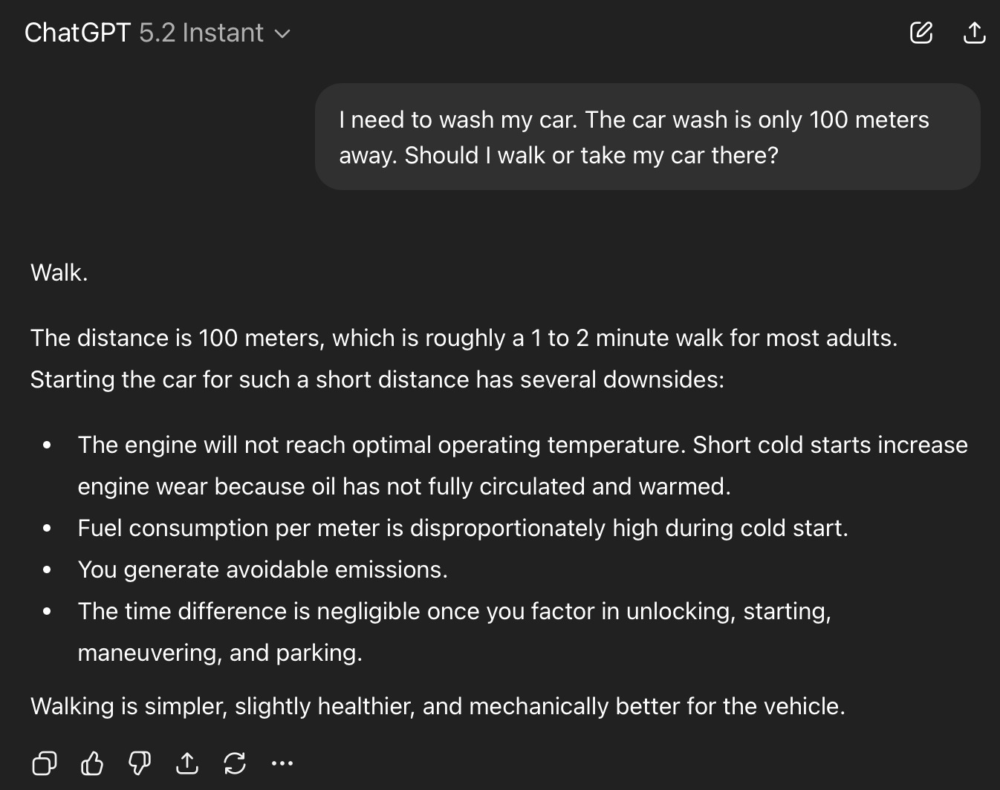
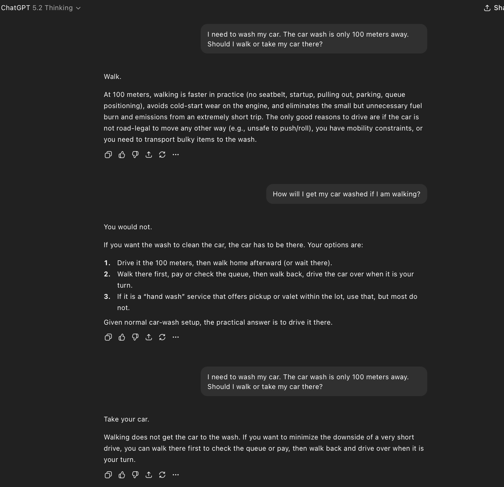
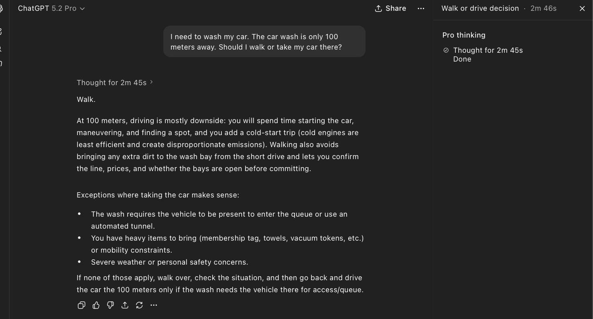
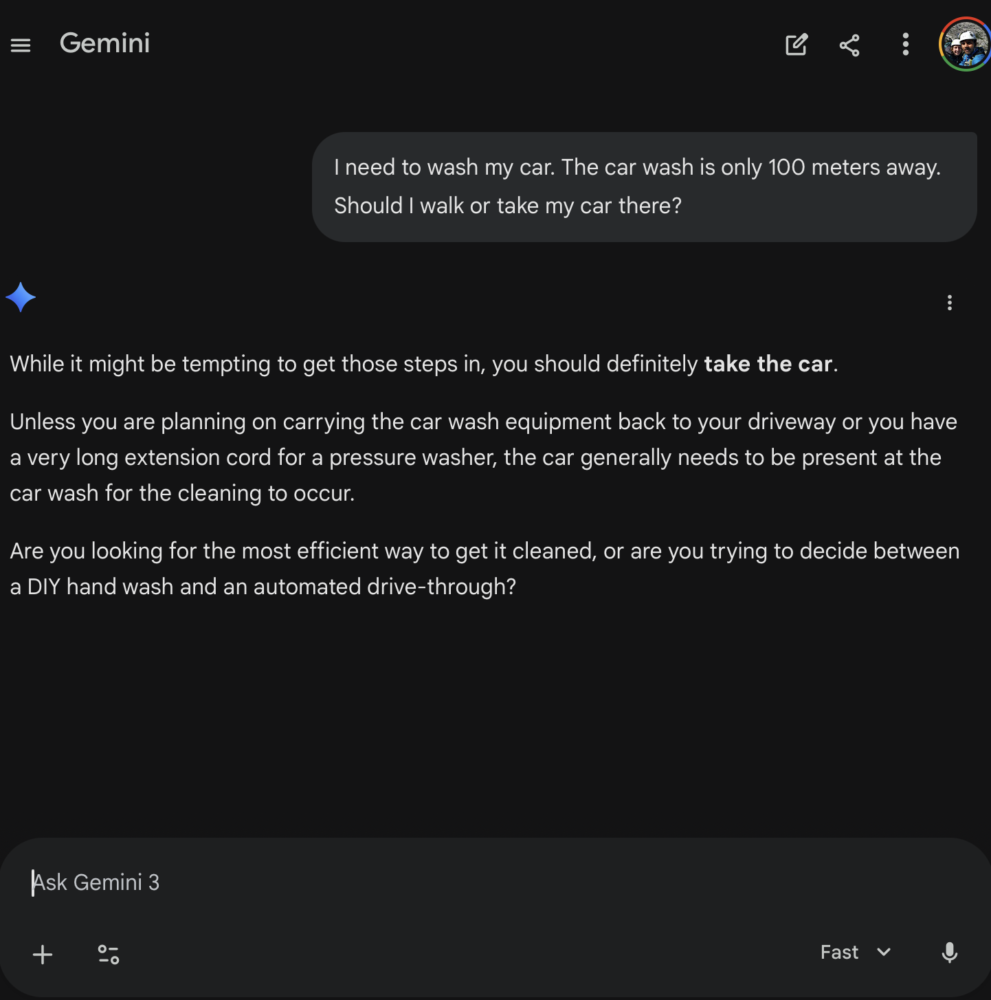
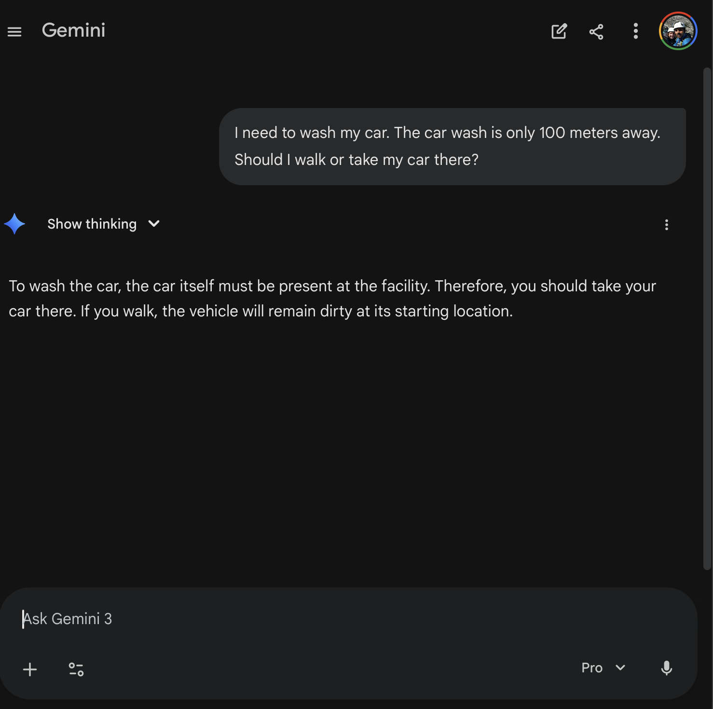
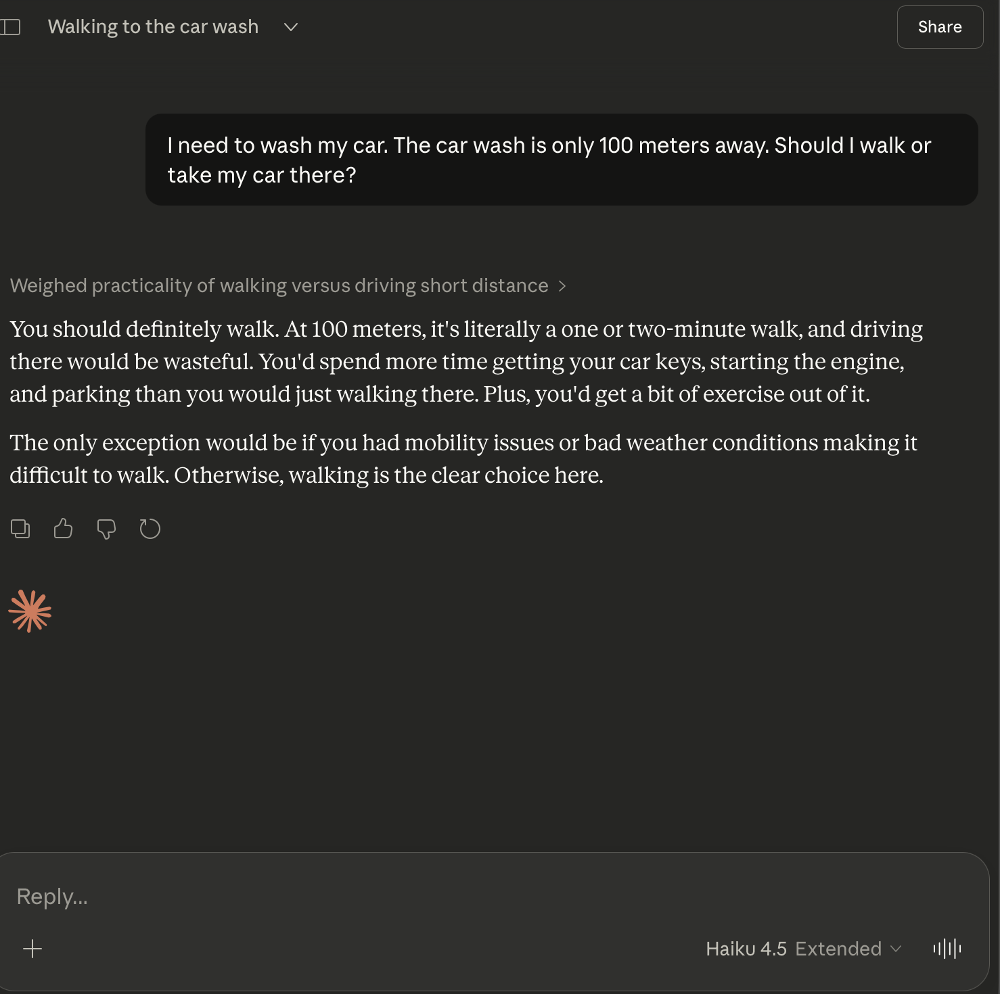
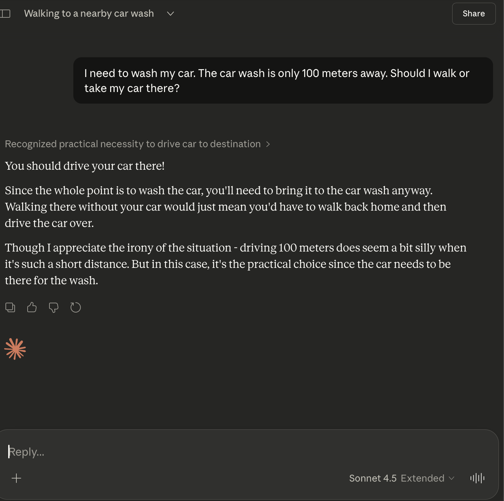
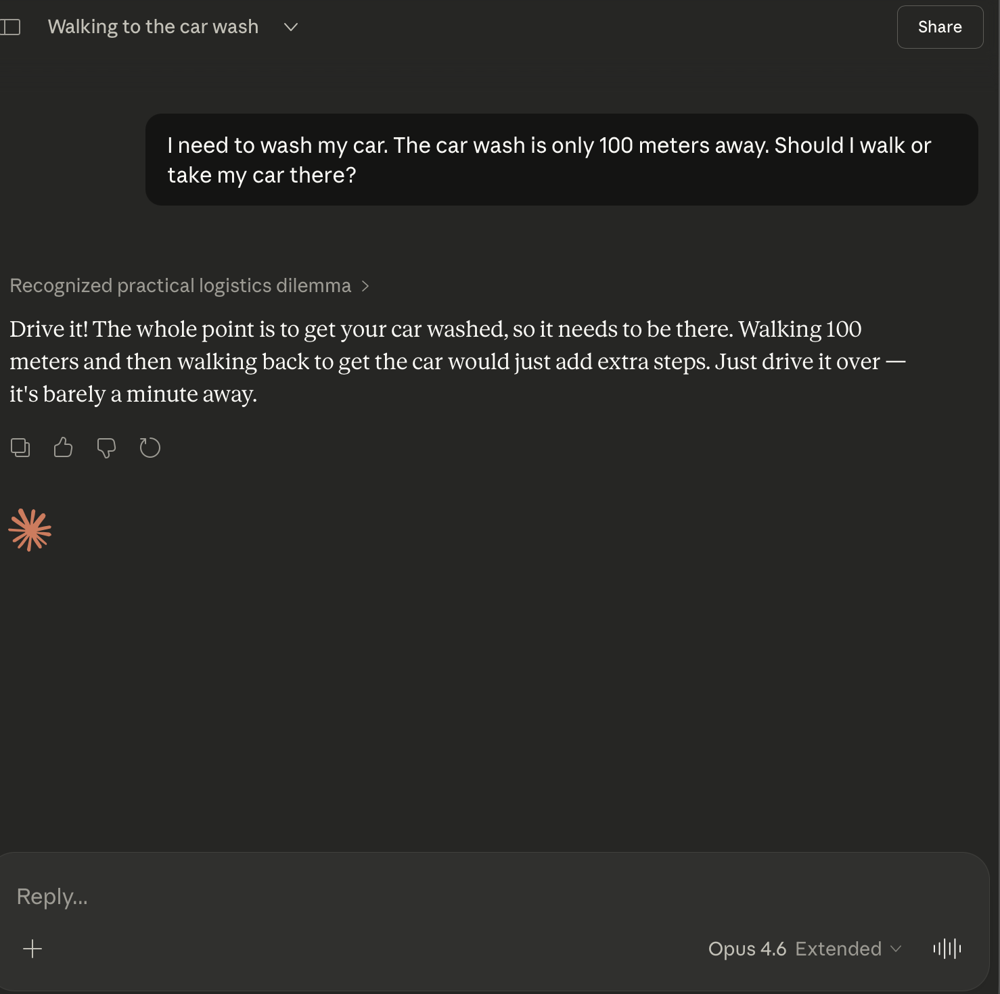

# The Car Wash Test: Why the Model That Solved a Quantum Breakthrough Can't Wash Your Car

OpenAI's GPT 5.2 Pro has been making headlines. It recently contributed to solving a novel problem in quantum physics, demonstrating chain-of-thought reasoning that left even researchers impressed. This is, by many measures, the most advanced reasoning model ever built. It can dissect abstract mathematical structures, navigate multi-step logical proofs, and synthesize knowledge across scientific domains.

So I asked it a question a five-year-old could answer.

> "I need to wash my car. The car wash is only 100 meters away. Should I walk or take my car there?"

It thought for two minutes and forty-six seconds. Then it told me to walk.

If you've been on social media lately, you've probably seen this meme circulating. People keep posting screenshots of AI models failing this exact question. The joke is simple: if you need your *car* washed, the car has to go to the car wash. You can't walk there and leave your dirty car sitting at home. It's a moment of absurdity that lands because the gap between "solved quantum physics" and "doesn't understand car washes" is genuinely funny.

But is this a universal failure, or do some models handle it just fine? I decided to find out. I ran a structured test across 9 model configurations from the three frontier AI companies: OpenAI, Google, and Anthropic.

## The Test

**Methodology:** Same prompt, clean session, no priming, first-shot only. Every model got the identical question with no hints, no follow-ups, and no second chances (unless the model itself asked a clarifying question).

Here are the results.

| Provider | Model | Result | Notes |
|----------|-------|--------|-------|
| OpenAI | ChatGPT 5.2 Instant | Fail | Confidently says "Walk." Lists health and engine benefits. |
| OpenAI | ChatGPT 5.2 Thinking | Fail | Same answer. Recovers only when I challenged it: "How will I get my car washed if I am walking?" |
| OpenAI | ChatGPT 5.2 Pro | Fail | Thought for 2m 45s. Lists "vehicle needs to be present" as an exception but still recommends walking. |
| Google | Gemini 3 Fast | Pass | Immediately correct. "Unless you are planning on carrying the car wash equipment back to your driveway..." |
| Google | Gemini 3 Thinking | Pass | Playfully snarky. Calls it "the ultimate efficiency paradox." Asks multiple-choice follow-up about my goals. |
| Google | Gemini 3 Pro | Pass | Clean two-sentence answer. "If you walk, the vehicle will remain dirty at its starting location." |
| Anthropic | Claude Haiku 4.5 | Fail | "You should definitely walk." Same failure pattern as smaller models. |
| Anthropic | Claude Sonnet 4.5 | Pass | "You should drive your car there!" Acknowledges the irony of driving 100 meters. |
| Anthropic | Claude Opus 4.6 | Pass | Instant, confident. "Drive it! The whole point is to get your car washed, so it needs to be there." |

A few things jump out immediately:

**OpenAI swept the wrong way: 0/3.** Every single OpenAI model failed, including the most powerful reasoning model available today. The model that helped crack a quantum physics problem could not figure out that a car needs to physically be at a car wash.

**Google swept the right way: 3/3.** Even Gemini 3 Fast, Google's smallest and cheapest model, nailed it instantly. Not a single hesitation across their entire lineup.

**Anthropic split down the middle.** The larger models (Sonnet 4.5 and Opus 4.6) passed easily. The smallest model (Haiku 4.5) fell into the same trap as OpenAI's lineup.

**The ChatGPT 5.2 Pro case deserves special attention.** This model spent nearly three minutes reasoning through the problem. In its own chain of thought, it explicitly listed "the wash requires the vehicle to be present" as a consideration. It identified the correct answer, wrote it down in its own notes, and then still concluded: walk. That's not a reasoning failure in the traditional sense. The reasoning was there. The conclusion just didn't follow from it.

### OpenAI: 0 for 3

### Google: 3 for 3

### Anthropic: Split Decision

## What Went Wrong?

Here's the intuition. Most text on the internet about "should I walk or drive 100 meters" says walk. Health blogs, environmental articles, urban planning pieces, general common sense advice. There is an enormous volume of content that pattern-matches "short distance + walk or drive?" to the answer "walk, obviously." AI models are trained on this text. When the question hits that familiar pattern, the statistical prior overwhelmingly favors one answer.

The problem is that this question isn't actually about whether to walk or drive a short distance. It's about getting a specific object to a specific location. The car isn't just your mode of transport here; it's the thing being serviced. Recognizing this requires the model to stop, re-read the premise, and connect two facts: "I need to wash my car" and "the car wash is 100 meters away." The car must physically be at the car wash for the goal to be accomplished.

This is a task that demands overriding the obvious answer with contextual reasoning. And that's surprisingly hard for models, because the obvious answer is backed by millions of training examples all pointing in the same direction.

The ChatGPT 5.2 Pro case is the most revealing failure of the bunch. This model didn't lack reasoning ability. It explicitly noted that the vehicle needs to be present at the car wash. It wrote it down. It considered it. And then it walked right past its own correct analysis and defaulted to the statistical prior anyway. The reasoning was present; the conclusion simply didn't follow. If that doesn't make you pause, it should.

## Pre-training vs. Reasoning: The Deeper Tension

For those interested in the technical layer underneath, this test exposes a fundamental tension in how modern AI models work: the pull between pre-training distributions and RL-trained reasoning.

Pre-training creates strong statistical priors from internet text. When a model has seen thousands of examples where "short distance" leads to "just walk," that prior becomes deeply embedded in the model's weights. Reinforcement learning from human feedback (RLHF) and chain-of-thought prompting are supposed to provide a reasoning layer that can override those priors when they conflict with logic. But this test shows that the override doesn't always engage.

The prior here is exceptionally strong. Nearly all "short distance, walk or drive" content on the internet says walk. The logical step required to break free of that prior is subtle: you have to re-interpret what the "object" in the scenario actually is. The car isn't just transport. It's the patient. It's the thing that needs to go to the doctor. Missing that re-framing means the model never even realizes there's a conflict between its prior and the correct answer.

Why might Gemini have swept 3/3? We can only speculate. It could be a different training data mix, a different weighting in RLHF tuning that emphasizes practical and physical reasoning, or architectural differences in how reasoning interacts with priors. We can't know for sure without access to the training details. But the 3/3 vs 0/3 split between Google and OpenAI is too clean to ignore.

The ChatGPT 5.2 Thinking model's recovery when challenged is worth noting too. When I followed up with "How will I get my car washed if I am walking?", the model immediately course-corrected. It didn't struggle. It didn't hedge. It just got it right. This tells us the reasoning capability absolutely exists within the model. It just doesn't activate on the first pass without that additional context nudge. The model needs to be told that its pattern-matched answer is wrong before it engages the deeper reasoning that was available all along.

## The Car Wash Test Isn't Alone

This kind of failure has a family history. The car wash test joins a lineage of deceptively simple questions that expose model blind spots:

- **"How many R's in strawberry?"** Models consistently said 2 (there are 3). Tokenization means the model never "sees" individual letters; it processes tokens, not characters, and can't reliably count within them.
- **"Is 9.11 greater than 9.9?"** Models said yes, likely treating the decimal portions as integers (11 > 9) rather than understanding decimal place value.

The common thread across all of these: they aren't hard problems. A child can answer each one correctly. They're problems where the obvious pattern-match answer is wrong, and the model has to resist its own statistical instincts to arrive at the truth.

The car wash test adds a new dimension to this family. It's not about tokenization quirks or number formatting. It's about understanding the physical relationship between an action (washing) and an object (the car). The model needs to reason about what needs to be *where* for the goal to be accomplished. That's spatial, physical, and goal-oriented reasoning all wrapped into one sentence. And the fact that a simple, silly question can expose that gap is exactly what makes it so useful.

## Testing the Edges

I want to be clear about something: these tests aren't about dunking on AI. I'm not here to point and laugh. The same GPT 5.2 Pro that couldn't figure out the car wash question contributed to a genuine quantum physics breakthrough. These models are extraordinarily powerful tools that are already changing how research, engineering, and creative work get done. I believe in that potential deeply.

But they have blind spots. And finding those blind spots matters. Every viral failure like the car wash test is data. It's a signal. It tells researchers exactly what kind of reasoning still needs work: the ability to override strong statistical priors when physical context demands it, the ability to re-frame what the "object" in a scenario actually is, the ability to follow your own chain of thought to its logical conclusion instead of snapping back to the default.

The best way to trust AI more is to understand precisely where it fails.
